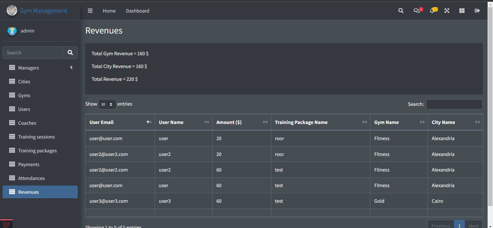

# Laravel Gym App

# Pattern
DRY "Don't Repeat Yourself" Dynamic rendering of all pages
* Dynamic Initialization - Validation - Creation - Editing - Deleting HTML Forms.

## Website Functionality
This is project that features an gym management application with multi-roles authorization (admin, city-manager, gym-manager , user) using Laravel 9 Framework.

### Prerequisites

Install node.js, php, mysql

### Installing
1. Run this command to update composer packages
    ```sh
    composer install
    ```
2. Create a copy of your .env file
    ```sh
    copy .env.example .env
    ```
3. Generate an app encryption key
    ```sh
    php artisan key:generate
    ```
4. Create an empty database for our application in your DBMS
5. In the .env file, add database information to allow Laravel to connect to the database
6. Migrate the database
    ```sh
    php artisan migrate
    ```
   
7. Seed the database
    ```sh
    php artisan db:seed
    ```
   
8. Run this command to install npm packages
    ```sh
    npm install
    ```
   
8. Run this command to compile resources
    ```sh
    npm run dev
    ```
10. Open up the server
    ```sh
    php artisan serve
    ```
11. Open your browser on this url [http://localhost:8000](http://localhost:8000)

# Demo
Try our Website on Heroku [http://dynamic-render-gym.herokuapp.com](http://dynamic-render-gym.herokuapp.com)

# Screenshots





